<div align="center">

# Open Jarvis

**An open-source alternative to Claude Cowork**

A powerful cross-platform desktop AI programming assistant built on Electron + React + LangGraph,
supporting multi-model, MCP tool extension, HITL approval, embedded toolchain,
interruption queue, and full local sandbox execution.

[English](#english) | [中文](#中文)

---

</div>

<a id="english"></a>

## Screenshots

<table>
  <tr>
    <td align="center"><b>Main - Light</b></td>
    <td align="center"><b>Main - Dark</b></td>
  </tr>
  <tr>
    <td>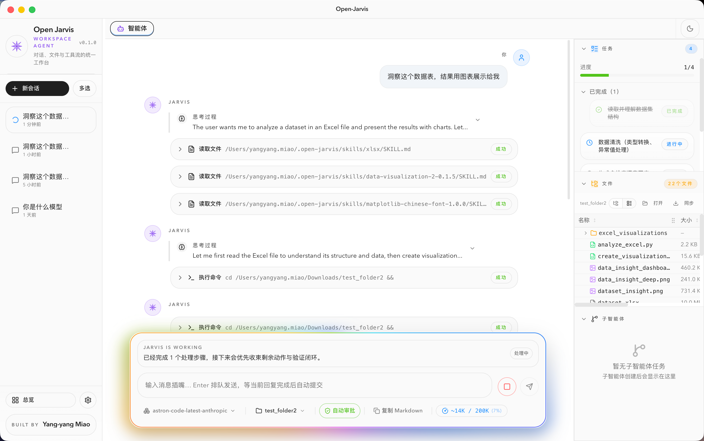</td>
    <td>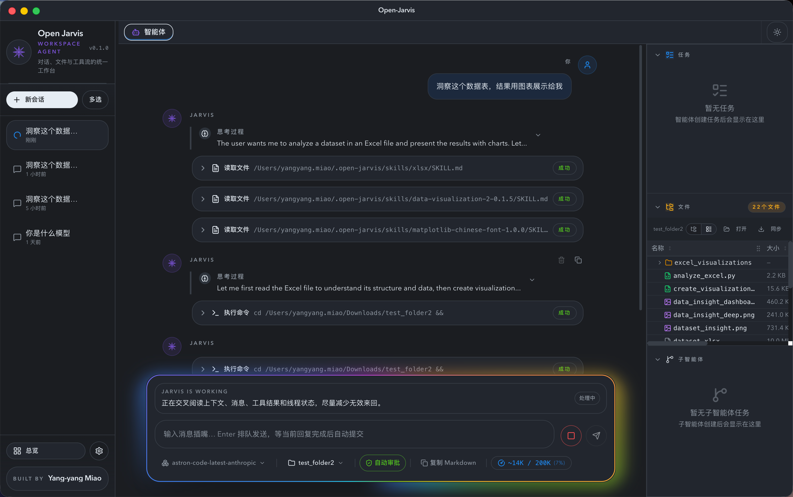</td>
  </tr>
  <tr>
    <td align="center"><b>Result - Light</b></td>
    <td align="center"><b>Result - Dark</b></td>
  </tr>
  <tr>
    <td>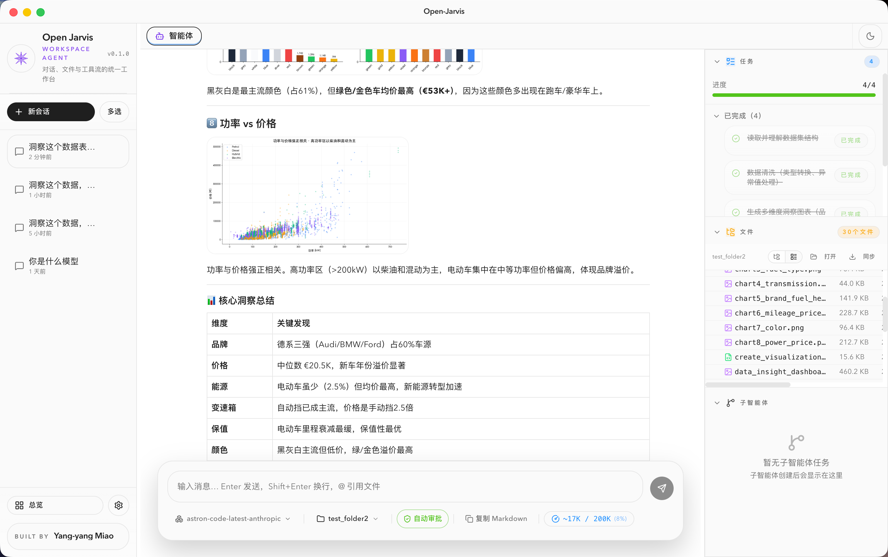</td>
    <td>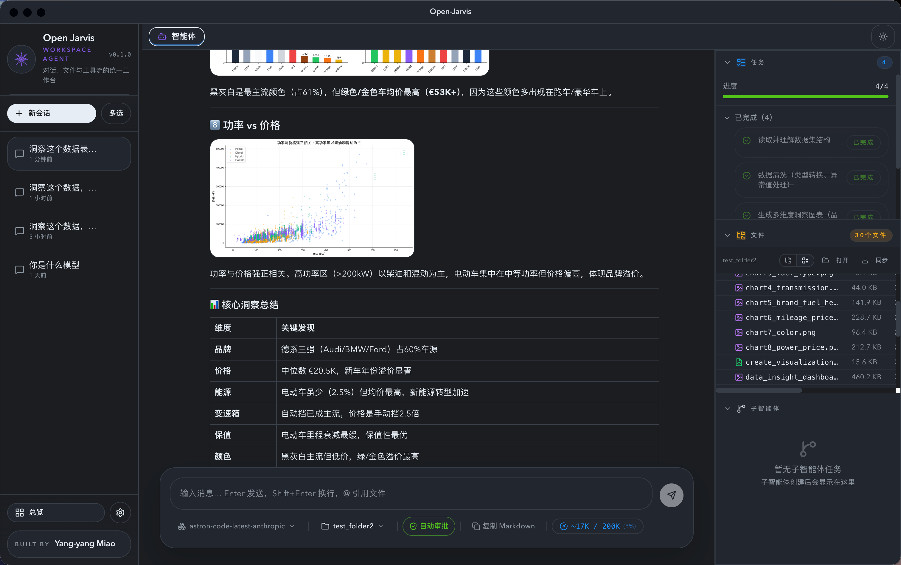</td>
  </tr>
  <tr>
    <td align="center"><b>HITL Approval - Light</b></td>
    <td align="center"><b>HITL Approval - Dark</b></td>
  </tr>
  <tr>
    <td>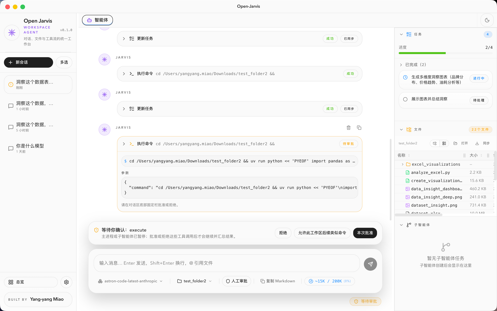</td>
    <td>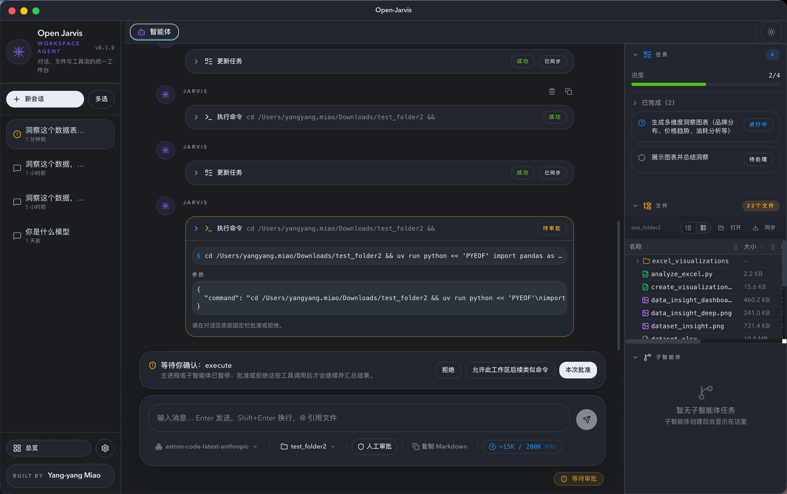</td>
  </tr>
  <tr>
    <td align="center"><b>File Preview - Light</b></td>
    <td align="center"><b>File Preview - Dark</b></td>
  </tr>
  <tr>
    <td>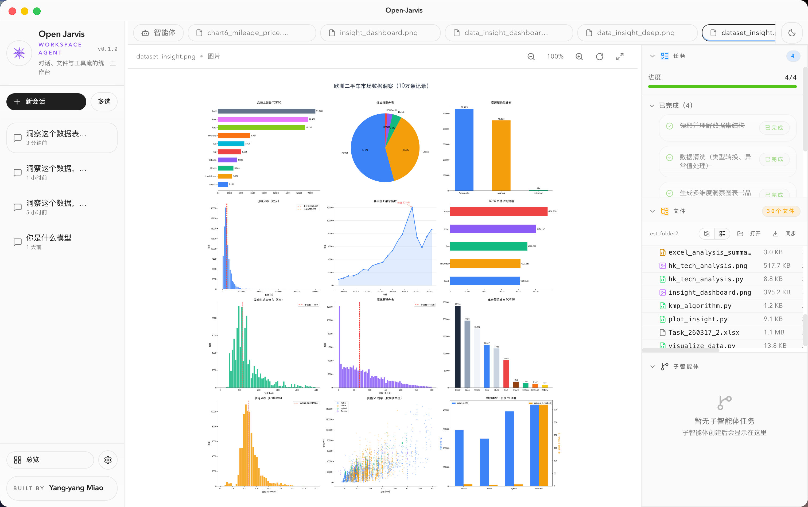</td>
    <td>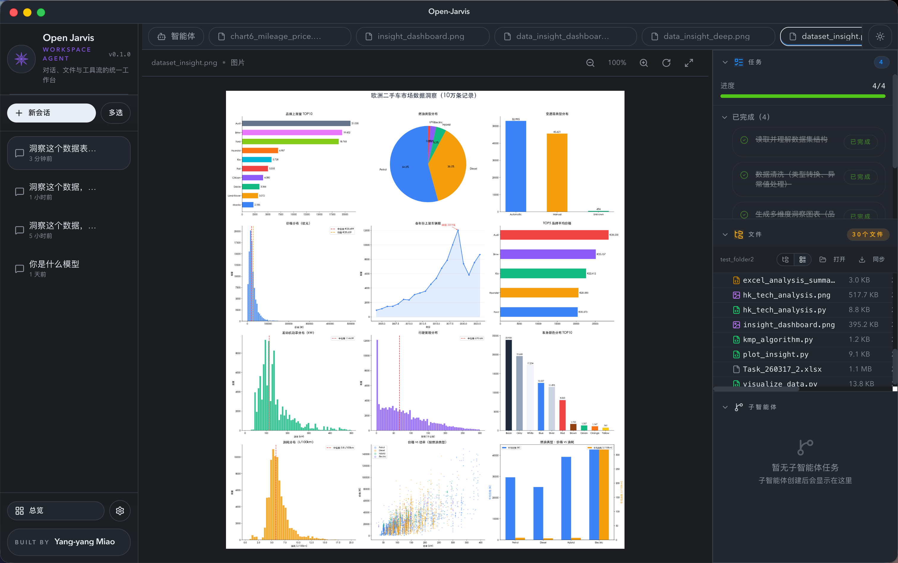</td>
  </tr>
  <tr>
    <td align="center"><b>Settings - Light</b></td>
    <td align="center"><b>Settings - Dark</b></td>
  </tr>
  <tr>
    <td>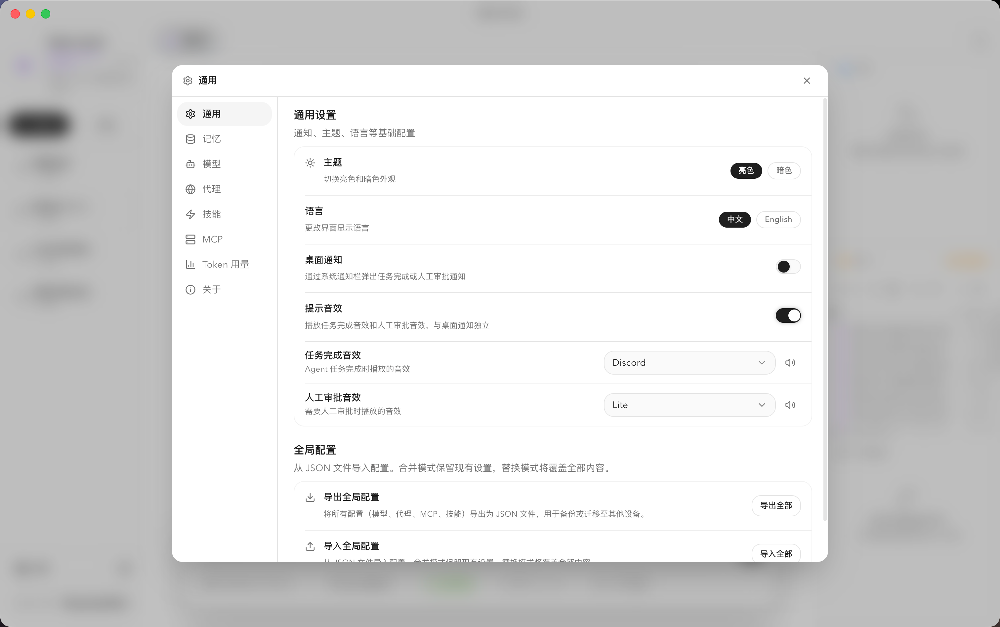</td>
    <td>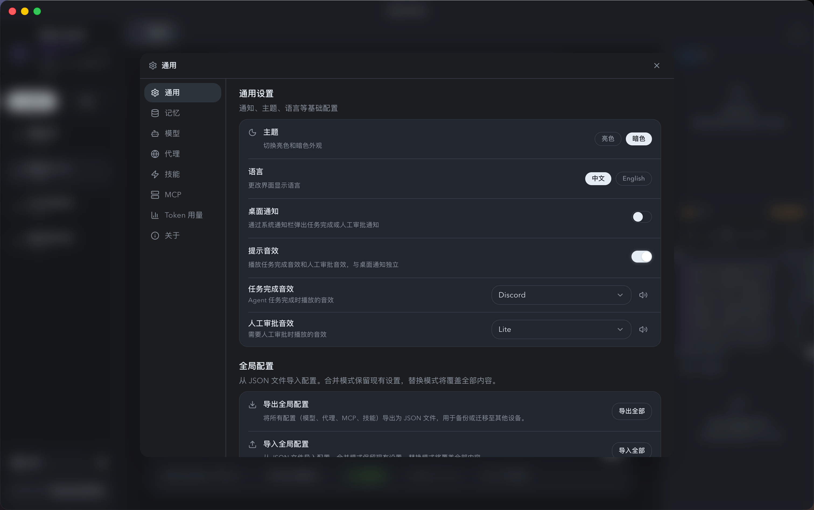</td>
  </tr>
  <tr>
    <td align="center"><b>Kanban - Light</b></td>
    <td align="center"><b>Kanban - Dark</b></td>
  </tr>
  <tr>
    <td>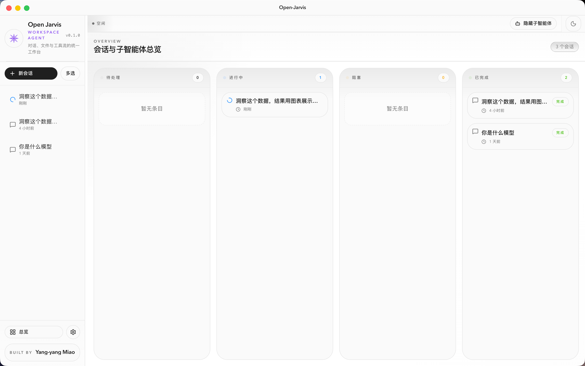</td>
    <td>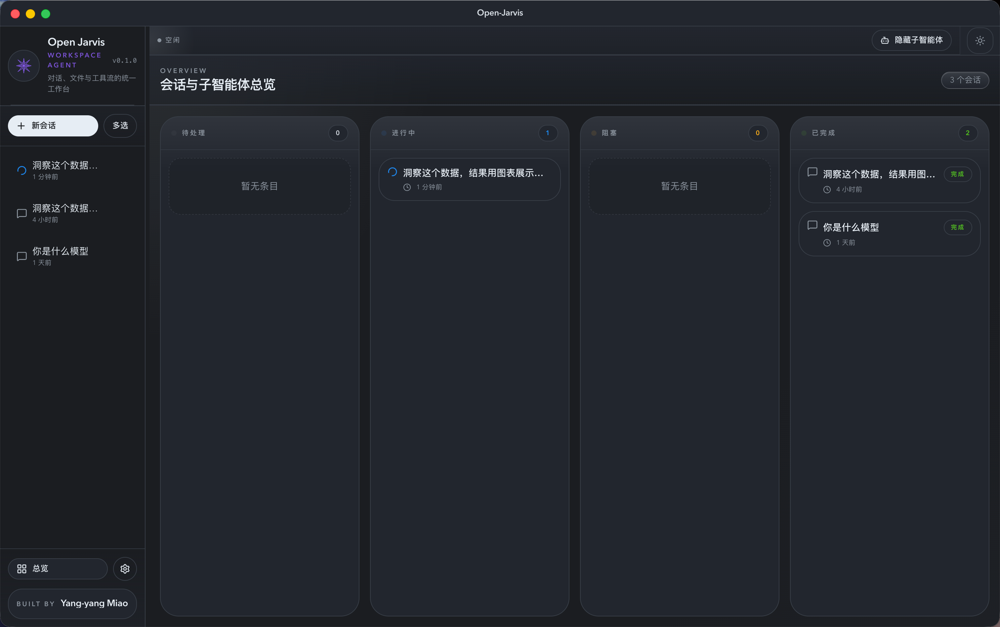</td>
  </tr>
</table>

---

## Features

### Multi-Model Support

- **Anthropic Claude** — Claude Opus / Sonnet / Haiku full series
- **OpenAI** — GPT-5 / GPT-4.1 / GPT-4o / O1 / O3 / O4 series
- **Google Gemini** — Gemini 3 Pro / 2.5 Pro / 1.5 Pro etc.
- **OpenAI-Compatible** — DeepSeek, Qwen, GLM, Minimax and any model with an OpenAI-compatible API. Custom API format (openai / anthropic), thinking mode, and context window.

### Agent Runtime

- Based on `deepagents` + LangGraph agent loop with tool calling, subagent delegation, and task management
- Per-thread independent checkpoints (SQLite) with message rewind and history replay
- Streaming output with real-time token-level display
- Customizable system prompt per workspace

### Interruption Queue (Butt-in)

- Send messages while the AI is still streaming — they enter a queue
- Queued messages appear immediately in the chat with a "Queued" badge (semi-transparent)
- When the current API interaction completes, queued messages are automatically merged and submitted
- Cancel clears the entire queue

### Local Sandbox Execution

- Embedded toolchain: bundled bun 1.3.13, uv 0.11.7, Python 3.12.13 — no system install needed
- Auto-intercept direct `python/pip/node/npm` calls, redirect to embedded runtimes
- Cross-platform: macOS uses shell function overrides; Windows uses `.cmd` shim files
- Auto-create `.venv` virtual environment
- Command timeout 120s, output truncation 100KB
- Text encoding: UTF-8 primary + GB18030 fallback

### HITL Approval (Human-in-the-Loop)

- Tool execution can be interrupted for user approval
- Manual / auto approval modes per thread
- "Remember this decision": persist approval rules to workspace `.open-jarvis/approval-rules.json`
- Approval signature normalization to prevent rule mismatch from command detail drift

### MCP Tool Extension

- Model Context Protocol support — connect to any MCP server
- Three transports: stdio / streamable_http / sse
- Remote connections with custom HTTP headers
- Per-thread enable/disable of MCP servers
- Config import/export

### Workspace Management

- Bind local project directory as workspace
- Real-time file change monitoring and sync
- File tree / list dual view
- Built-in file preview: code (Shiki, 35+ languages), images, PDF, audio/video
- Multi-tab browsing

### Skill System

- Global skill directory `~/.open-jarvis/skills/`
- Markdown + YAML frontmatter format
- Skill import, create, edit, rename

### Memory & Skill Precipitation

- Per-workspace memory directory `.open-jarvis/memories/` — auto-consolidated after each conversation
- Agent auto-recalls relevant memories before planning (passive `ls` + `read_file` guidance)
- Token Jaccard similarity matching (threshold 0.35) for smart memory merge vs. create
- Skill promotion: memories reaching recall threshold (default 3) are prompted for precipitation into global skills
- Undo settlement / reject promotion — fully reversible
- Context assistant card: shows recalled memories and used skills in chat

### Proxy Support

- HTTP / HTTPS / ALL_PROXY configuration
- Auto-set case-insensitive env var aliases
- Global undici ProxyAgent dispatcher

### Other

- Kanban view: threads by status (idle / busy / interrupted / error)
- Context window monitoring: real-time token usage vs model context ratio
- Conversation export to Markdown
- Light / dark theme toggle
- macOS custom title bar

---

## Tech Stack

| Layer | Tech |
|-------|------|
| Shell | Electron 42 + electron-vite 5 |
| Main Process | TypeScript, Node.js 24+ |
| Renderer | React 19 + Tailwind CSS 4 + Radix UI + Zustand 5 |
| Agent | deepagents + LangGraph |
| Model Integration | @langchain/anthropic, @langchain/openai, @langchain/google-genai |
| MCP | @modelcontextprotocol/sdk |
| Checkpoint | sql.js (per-thread SQLite) |
| Code Highlight | Shiki |
| Markdown | react-markdown + remark-gfm + remark-math + rehype-katex |
| Package Manager | Bun |
| Build | Vite 8 + electron-builder 26 |

---

## Quick Start

### Prerequisites

- [Bun](https://bun.sh/) >= 1.0
- Node.js >= 20 (for development; runtime provided by Electron)

### Install Dependencies

```bash
bun install
```

### Install Electron

After `bun install`, you **must** run the Electron install script to download the Electron binary:

```bash
bun node_modules/electron/install.js
```

> **Note for users in mainland China:** The Electron binary is hosted on GitHub releases. If the download fails, please enable a proxy (e.g. set `HTTPS_PROXY` environment variable) before running the install script.

### Development Mode

```bash
bun run dev
```

Opens the Electron window with hot reload for both main and renderer processes.

### Build & Package

```bash
bun run dist              # Current platform
bun run dist:mac          # macOS (.dmg)
bun run dist:win          # Windows (NSIS installer)
bun run dist:linux        # Linux (AppImage + tar.gz)
```

### Embedded Toolchain Preparation

In dev mode, toolchain is read from `resources/tooling/`. To re-prepare:

```bash
# Current platform
bun run prepare:tooling

# Specific platform
bun run prepare:tooling:darwin:arm64   # macOS Apple Silicon
bun run prepare:tooling:darwin:x64     # macOS Intel
bun run prepare:tooling:win:x64        # Windows x64
bun run prepare:tooling:linux:x64      # Linux x64
```

---

## Project Structure

```
open-jarvis/
├── src/
│   ├── main/                    # Electron main process
│   │   ├── index.ts             # App entry, window creation, IPC registration
│   │   ├── agent/               # Agent runtime
│   │   │   ├── runtime.ts       # Core: model routing, runtime assembly
│   │   │   ├── system-prompt.ts # Agent system prompt
│   │   │   ├── local-sandbox.ts # Local sandbox (file read/write, command exec)
│   │   │   ├── mcp-runtime.ts   # MCP connection management
│   │   │   └── types.ts        # Agent type definitions
│   │   ├── ipc/                 # IPC handlers (7 modules)
│   │   │   ├── agent.ts         # Conversation flow, HITL, cancel
│   │   │   ├── threads.ts       # Thread CRUD, history, rewind
│   │   │   ├── models.ts        # Model list, API Key, workspace operations
│   │   │   ├── approval.ts      # Approval mode
│   │   │   ├── mcp.ts           # MCP config
│   │   │   ├── skills.ts        # Skill management
│   │   │   └── settings.ts      # Proxy config
│   │   ├── checkpointer/        # Checkpoint storage
│   │   │   └── sqljs-saver.ts   # Per-thread SQLite checkpoint
│   │   ├── db/                  # Persistent database
│   │   │   └── index.ts         # Thread, run, assistant CRUD
│   │   ├── services/            # Auxiliary services
│   │   │   ├── title-generator.ts
│   │   │   └── workspace-watcher.ts
│   │   ├── storage.ts           # ~/.open-jarvis directory & .env management
│   │   ├── approval-settings.ts # Approval rules & workspace rules
│   │   ├── mcp-config.ts        # MCP config CRUD
│   │   ├── skill-config.ts      # Skill source directory resolution
│   │   ├── openai-compatible-profiles.ts  # Custom model config
│   │   ├── tooling.ts           # Embedded toolchain resolution
│   │   ├── text-encoding.ts     # UTF-8 / GB18030 decoding
│   │   ├── proxy-config.ts      # Proxy config & global dispatcher
│   │   ├── global-config.ts     # Global config export/import
│   │   ├── logger.ts            # Logging
│   │   └── types.ts             # Main process shared types
│   ├── preload/                 # contextBridge bridge layer
│   │   ├── index.ts             # window.api exposure
│   │   └── index.d.ts           # Type contract
│   ├── renderer/src/            # React renderer
│   │   ├── App.tsx              # Three-column layout
│   │   ├── lib/                 # State & utilities
│   │   │   ├── store.ts         # Global Zustand store
│   │   │   ├── thread-context.tsx  # Thread state + stream subscription
│   │   │   ├── electron-transport.ts  # IPC → LangGraph Transport
│   │   │   └── ...
│   │   └── components/          # UI components
│   │       ├── chat/            # Chat area (20 components)
│   │       ├── panels/          # Right panel
│   │       ├── tabs/            # Tabs & file preview
│   │       ├── sidebar/         # Thread sidebar
│   │       ├── kanban/          # Kanban view
│   │       └── ui/              # Base components (Radix UI)
│   ├── model-context.ts         # Model context window config
│   └── types.ts                 # Renderer shared types
├── resources/tooling/           # Embedded toolchain (per platform)
├── scripts/
│   └── prepare-embedded-tooling.mjs  # Toolchain preparation script
├── bin/cli.js                   # CLI entry
└── release/                     # Build output
```

---

## Architecture

```
┌──────────────────────────────────────────────────────────────┐
│                     Renderer Process                         │
│   React 19 + Zustand + Tailwind CSS 4                        │
│   ThreadProvider → useStream → ElectronIPCTransport          │
├──────────────────────────┬───────────────────────────────────┤
│       window.api         │       window.electron              │
│   (contextBridge)       │   (raw IPC access)                │
├──────────────────────────┴───────────────────────────────────┤
│                      Preload Layer                           │
│   8 namespaces: agent / threads / approval / models /        │
│   workspace / mcp / skills / settings                        │
├──────────────────────────────────────────────────────────────┤
│                      Main Process                            │
│   ┌──────────┐  ┌──────────┐  ┌──────────┐  ┌──────────┐   │
│   │ Agent    │  │ MCP      │  │ DB       │  │ Storage  │   │
│   │ Runtime  │  │ Runtime  │  │ (SQLite) │  │ (.env)   │   │
│   └──────────┘  └──────────┘  └──────────┘  └──────────┘   │
│   ┌──────────┐  ┌──────────┐  ┌──────────┐                  │
│   │ Local    │  │ Tooling  │  │ Proxy    │                  │
│   │ Sandbox  │  │ (embedded)│  │ (undici) │                  │
│   └──────────┘  └──────────┘  └──────────┘                  │
└──────────────────────────────────────────────────────────────┘
```

### Core Data Flow

1. **Message Send**: User input → `ChatContainer` → `ElectronIPCTransport` → IPC `agent:invoke` → `AgentRuntime.stream()` → stream events → `ThreadContext` update → React re-render

2. **HITL Approval**: Agent executes tool → `interruptOn` interrupts → main process pushes interrupt event → renderer shows approval UI → user decision → `agent:resume` → agent continues

3. **Workspace Sync**: User selects directory → `workspace:select` → file list loaded → `workspace-watcher` monitors changes → `workspace:files-changed` notifies renderer

4. **Interruption Queue**: User sends message while AI is streaming → message enters `interruptionQueue` with `_queued` flag → displayed semi-transparent with "Queued" badge → when stream ends, queued messages are merged and auto-submitted → queue cleared

---

## Data Storage

| Data | Location |
|------|----------|
| App Data | `~/.open-jarvis/` |
| Main Database | `~/.open-jarvis/openwork.sqlite` |
| Thread Checkpoints | `~/.open-jarvis/threads/{threadId}.sqlite` |
| API Keys | `~/.open-jarvis/.env` |
| Approval Rules | `{workspace}/.open-jarvis/approval-rules.json` |
| MCP Config | electron-store `settings.json` |
| Skills (global) | `~/.open-jarvis/skills/` |

> Note: The app automatically migrates data from the old path `~/.openwork` to `~/.open-jarvis`.

---

## Development Guide

### Code Checks

```bash
bun run typecheck       # Full TypeScript check
bun run typecheck:node  # Main process + preload
bun run typecheck:web   # Renderer process
bun run lint            # ESLint
bun run format          # Prettier
```

### Add New IPC Capability

1. Register handler in `src/main/ipc/*.ts`
2. Call `register*Handlers(ipcMain)` in `src/main/index.ts`
3. Expose to `window.api` in `src/preload/index.ts`
4. Add type declaration in `src/preload/index.d.ts`

### Add New Model Support

1. Add model routing in `src/main/agent/runtime.ts` → `createAgentRuntime`
2. Add context window config in `src/model-context.ts`
3. Add types in `src/main/types.ts` if needed

---

## License

This project is licensed under the [Apache License 2.0](LICENSE).

---

<a id="中文"></a>

## 界面预览

<table>
  <tr>
    <td align="center"><b>主界面 - 亮色</b></td>
    <td align="center"><b>主界面 - 深色</b></td>
  </tr>
  <tr>
    <td></td>
    <td></td>
  </tr>
  <tr>
    <td align="center"><b>结果展示 - 亮色</b></td>
    <td align="center"><b>结果展示 - 深色</b></td>
  </tr>
  <tr>
    <td></td>
    <td></td>
  </tr>
  <tr>
    <td align="center"><b>人工审批 - 亮色</b></td>
    <td align="center"><b>人工审批 - 深色</b></td>
  </tr>
  <tr>
    <td></td>
    <td></td>
  </tr>
  <tr>
    <td align="center"><b>文件预览 - 亮色</b></td>
    <td align="center"><b>文件预览 - 深色</b></td>
  </tr>
  <tr>
    <td></td>
    <td></td>
  </tr>
  <tr>
    <td align="center"><b>设置中枢 - 亮色</b></td>
    <td align="center"><b>设置中枢 - 深色</b></td>
  </tr>
  <tr>
    <td></td>
    <td></td>
  </tr>
  <tr>
    <td align="center"><b>多任务总览 - 亮色</b></td>
    <td align="center"><b>多任务总览 - 深色</b></td>
  </tr>
  <tr>
    <td></td>
    <td></td>
  </tr>
</table>

---

## 功能概览

### 多模型支持

- **Anthropic Claude** — Claude Opus / Sonnet / Haiku 全系列
- **OpenAI** — GPT-5 / GPT-4.1 / GPT-4o / O1 / O3 / O4 系列
- **Google Gemini** — Gemini 3 Pro / 2.5 Pro / 1.5 Pro 等
- **OpenAI 兼容模型** — 支持 DeepSeek、Qwen、GLM、Minimax 等任意兼容 OpenAI API 的模型，可自定义 API 格式（openai / anthropic）、思考模式与上下文窗口

### 智能体运行时

- 基于 `deepagents` + LangGraph 的智能体循环，支持工具调用、子代理委派、任务管理
- 每线程独立检查点（SQLite），支持消息回滚与历史重放
- 流式输出，实时 token 级展示
- 自定义系统提示，可针对工作区定制行为

### 插嘴功能（中断队列）

- AI 流式响应期间，用户可以继续输入消息，消息进入排队队列
- 排队消息立即显示在对话列表中，半透明 + "排队中"角标
- 当前 API 交互完成后，队列中的消息自动合并发送给大模型
- 取消操作会清空整个排队队列

### 本地沙箱执行

- 嵌入式工具链：自带 bun 1.3.13、uv 0.11.7、Python 3.12.13，无需系统预装
- 自动拦截 `python/pip/node/npm` 等直接调用，引导使用嵌入式运行时
- 跨平台支持：macOS 使用 shell 函数覆盖，Windows 使用 `.cmd` shim 文件
- 自动创建 `.venv` 虚拟环境
- 命令超时 120s，输出截断 100KB
- 文本编码兼容：UTF-8 优先 + GB18030 回退

### HITL 审批（Human-in-the-Loop）

- 工具执行前可中断等待用户审批
- 支持手动 / 自动两种审批模式
- "记住此决定"功能：将审批规则持久化到工作区 `.open-jarvis/approval-rules.json`
- 审批签名归一化，避免命令细节波动导致规则失配

### MCP 工具扩展

- 支持 Model Context Protocol，可连接任意 MCP 服务器
- 三种传输方式：stdio / streamable_http / sse
- 远程连接支持自定义 headers
- 每线程可独立启用/禁用 MCP 服务器
- 配置导入/导出

### 工作区管理

- 关联本地项目目录作为工作区
- 实时文件变更监听与同步
- 文件树/列表双视图
- 内置文件预览：代码（Shiki 高亮，35+ 语言）、图片、PDF、音视频
- 多标签页浏览

### 技能系统

- 全局技能目录 `~/.open-jarvis/skills/`
- 支持 Markdown + YAML frontmatter 格式
- 技能导入、创建、编辑、重命名

### 记忆与技能沉淀

- 工作区记忆目录 `.open-jarvis/memories/`，对话结束后自动沉淀关键经验
- Agent 在规划前自动检索相关记忆（被动引导：`ls` + `read_file`）
- Token Jaccard 相似度匹配（阈值 0.35），智能判断合并到已有记忆或创建新文件
- 技能晋升：记忆召回次数达到阈值（默认 3 次）后自动提示沉淀为全局技能
- 撤销沉淀 / 拒绝晋升 — 全链路可逆
- 上下文辅助卡片：在对话中展示本轮召回的记忆和使用的技能

### 代理支持

- 支持 HTTP / HTTPS / ALL_PROXY 代理配置
- 自动设置大小写环境变量别名
- 全局 undici ProxyAgent 分发器

### 其他

- 看板视图：按线程状态分列展示
- 上下文窗口监控：实时显示 token 使用量与模型上下文占比
- 对话导出 Markdown
- 亮色 / 深色主题切换
- macOS 自定义标题栏

---

## 技术栈

| 层级 | 技术 |
|------|------|
| Shell | Electron 42 + electron-vite 5 |
| 主进程 | TypeScript, Node.js 24+ |
| 渲染层 | React 19 + Tailwind CSS 4 + Radix UI + Zustand 5 |
| 智能体 | deepagents + LangGraph |
| 模型集成 | @langchain/anthropic, @langchain/openai, @langchain/google-genai |
| MCP | @modelcontextprotocol/sdk |
| 检查点 | sql.js（每线程独立 SQLite） |
| 代码高亮 | Shiki |
| Markdown | react-markdown + remark-gfm + remark-math + rehype-katex |
| 包管理 | Bun |
| 构建 | Vite 8 + electron-builder 26 |

---

## 快速开始

### 环境要求

- [Bun](https://bun.sh/) >= 1.0
- Node.js >= 20（开发时需要，运行时由 Electron 提供）

### 安装依赖

```bash
bun install
```

### 安装 Electron

`bun install` 之后，**必须**运行 Electron 安装脚本来下载 Electron 二进制文件：

```bash
bun node_modules/electron/install.js
```

> **中国大陆用户注意：** Electron 二进制文件托管在 GitHub releases 上，下载可能失败。建议在运行安装脚本前开启代理（如设置 `HTTPS_PROXY` 环境变量）。

### 开发模式

```bash
bun run dev
```

启动后自动打开 Electron 窗口，主进程与渲染进程均支持热更新。

### 构建与打包

```bash
# 类型检查 + 构建
bun run build

# 打包为本机可运行目录
bun run package:dir

# 生成发行包
bun run dist
```

### 嵌入式工具链准备

开发模式下工具链从仓库 `resources/tooling/` 读取。如需重新准备：

```bash
# 当前平台
bun run prepare:tooling

# 指定平台
bun run prepare:tooling:darwin:arm64   # macOS Apple Silicon
bun run prepare:tooling:darwin:x64     # macOS Intel
bun run prepare:tooling:win:x64        # Windows x64
bun run prepare:tooling:linux:x64      # Linux x64
```

---

## 项目结构

```
open-jarvis/
├── src/
│   ├── main/                    # Electron 主进程
│   │   ├── index.ts             # 应用入口，窗口创建，IPC 注册
│   │   ├── agent/               # 智能体运行时
│   │   │   ├── runtime.ts       # 核心：模型路由、运行时组装
│   │   │   ├── system-prompt.ts # Agent 系统提示
│   │   │   ├── local-sandbox.ts # 本地沙箱（文件读写、命令执行）
│   │   │   ├── mcp-runtime.ts   # MCP 连接管理
│   │   │   └── types.ts        # Agent 类型定义
│   │   ├── ipc/                 # IPC 处理器（7 个模块）
│   │   │   ├── agent.ts         # 对话流、HITL、取消
│   │   │   ├── threads.ts       # 线程 CRUD、历史、回滚
│   │   │   ├── models.ts        # 模型列表、API Key、工作区操作
│   │   │   ├── approval.ts      # 审批模式
│   │   │   ├── mcp.ts           # MCP 配置
│   │   │   ├── skills.ts        # 技能管理
│   │   │   └── settings.ts      # 代理配置
│   │   ├── checkpointer/        # 检查点存储
│   │   │   └── sqljs-saver.ts   # 每线程 SQLite 检查点
│   │   ├── db/                  # 持久化数据库
│   │   │   └── index.ts         # 线程、运行、助手 CRUD
│   │   ├── services/            # 辅助服务
│   │   │   ├── title-generator.ts
│   │   │   └── workspace-watcher.ts
│   │   ├── storage.ts           # ~/.open-jarvis 目录与 .env 管理
│   │   ├── approval-settings.ts # 审批规则与工作区规则
│   │   ├── mcp-config.ts        # MCP 配置 CRUD
│   │   ├── skill-config.ts      # 技能源目录解析
│   │   ├── openai-compatible-profiles.ts  # 自定义模型配置
│   │   ├── tooling.ts           # 嵌入式工具链定位
│   │   ├── text-encoding.ts     # UTF-8 / GB18030 解码
│   │   ├── proxy-config.ts      # 代理配置与全局分发器
│   │   ├── global-config.ts     # 全局配置导入/导出
│   │   ├── logger.ts            # 日志
│   │   └── types.ts             # 主进程共享类型
│   ├── preload/                 # contextBridge 桥接层
│   │   ├── index.ts             # window.api 暴露
│   │   └── index.d.ts           # 类型契约
│   ├── renderer/src/            # React 渲染层
│   │   ├── App.tsx              # 三栏布局
│   │   ├── lib/                 # 状态与工具
│   │   │   ├── store.ts         # 全局 Zustand store
│   │   │   ├── thread-context.tsx  # 线程状态 + 流订阅
│   │   │   ├── electron-transport.ts  # IPC → LangGraph Transport
│   │   │   └── ...
│   │   └── components/          # UI 组件
│   │       ├── chat/            # 对话区（20 个组件）
│   │       ├── panels/          # 右侧面板
│   │       ├── tabs/            # 标签页与文件预览
│   │       ├── sidebar/         # 左侧会话栏
│   │       ├── kanban/          # 看板视图
│   │       └── ui/              # 基础组件（Radix UI）
│   ├── model-context.ts         # 模型上下文窗口配置
│   └── types.ts                 # 渲染层共享类型
├── resources/tooling/           # 嵌入式工具链（按平台）
├── scripts/
│   └── prepare-embedded-tooling.mjs  # 工具链准备脚本
├── bin/cli.js                   # CLI 入口
└── release/                     # 打包产物
```

---

## 架构概览

```
┌──────────────────────────────────────────────────────────────┐
│                     渲染进程 (Renderer)                       │
│   React 19 + Zustand + Tailwind CSS 4                        │
│   ThreadProvider → useStream → ElectronIPCTransport          │
├──────────────────────────┬───────────────────────────────────┤
│       window.api         │       window.electron              │
│   (contextBridge 桥接)   │   (原始 IPC 访问)                  │
├──────────────────────────┴───────────────────────────────────┤
│                      Preload 层                              │
│   8 个命名空间: agent / threads / approval / models /        │
│   workspace / mcp / skills / settings                        │
├──────────────────────────────────────────────────────────────┤
│                      主进程 (Main)                           │
│   ┌──────────┐  ┌──────────┐  ┌──────────┐  ┌──────────┐   │
│   │ Agent    │  │ MCP      │  │ DB       │  │ Storage  │   │
│   │ Runtime  │  │ Runtime  │  │ (SQLite) │  │ (.env)   │   │
│   └──────────┘  └──────────┘  └──────────┘  └──────────┘   │
│   ┌──────────┐  ┌──────────┐  ┌──────────┐                  │
│   │ Local    │  │ Tooling  │  │ Proxy    │                  │
│   │ Sandbox  │  │ (嵌入式) │  │ (undici) │                  │
│   └──────────┘  └──────────┘  └──────────┘                  │
└──────────────────────────────────────────────────────────────┘
```

### 核心数据流

1. **消息发送**：用户输入 → `ChatContainer` → `ElectronIPCTransport` → IPC `agent:invoke` → `AgentRuntime.stream()` → 流式事件回推 → `ThreadContext` 更新 → React 重渲染

2. **HITL 审批**：Agent 执行工具 → `interruptOn` 中断 → 主进程推送中断事件 → 渲染层展示审批 UI → 用户决策 → `agent:resume` → Agent 继续执行

3. **工作区同步**：用户选择目录 → `workspace:select` → 文件列表加载 → `workspace-watcher` 监听变更 → `workspace:files-changed` 通知渲染层

4. **插嘴队列**：用户在 AI 流式响应期间发送消息 → 消息进入 `interruptionQueue`（标记 `_queued`）→ 半透明显示 + "排队中"角标 → 流结束后队列消息自动合并提交 → 队列清空

---

## 数据存储

| 数据 | 位置 |
|------|------|
| 应用数据 | `~/.open-jarvis/` |
| 主数据库 | `~/.open-jarvis/openwork.sqlite` |
| 线程检查点 | `~/.open-jarvis/threads/{threadId}.sqlite` |
| API Keys | `~/.open-jarvis/.env` |
| 审批规则 | `{workspace}/.open-jarvis/approval-rules.json` |
| MCP 配置 | electron-store `settings.json` |
| 技能（全局） | `~/.open-jarvis/skills/` |

> 注：应用会自动从旧路径 `~/.openwork` 迁移数据到 `~/.open-jarvis`。

---

## 开发指南

### 代码检查

```bash
bun run typecheck       # 全量 TypeScript 检查
bun run typecheck:node  # 主进程 + preload
bun run typecheck:web   # 渲染进程
bun run lint            # ESLint
bun run format          # Prettier 格式化
```

### 新增 IPC 能力

1. 在 `src/main/ipc/*.ts` 注册 handler
2. 在 `src/main/index.ts` 调用 `register*Handlers(ipcMain)`
3. 在 `src/preload/index.ts` 暴露到 `window.api`
4. 在 `src/preload/index.d.ts` 补类型声明

### 新增模型支持

1. 在 `src/main/agent/runtime.ts` 的 `createAgentRuntime` 中添加模型路由
2. 在 `src/model-context.ts` 中添加上下文窗口配置
3. 在 `src/main/types.ts` 中补充类型（如需要）

---

## 许可证

本项目基于 [Apache License 2.0](LICENSE) 开源。
